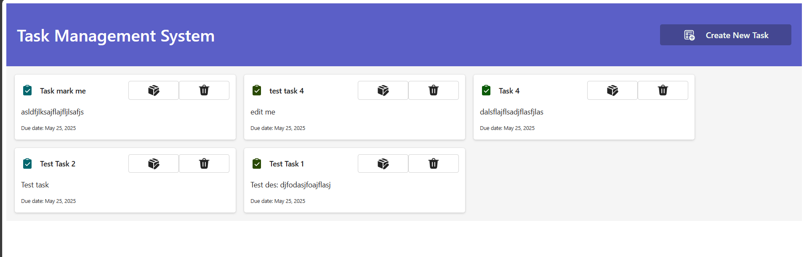
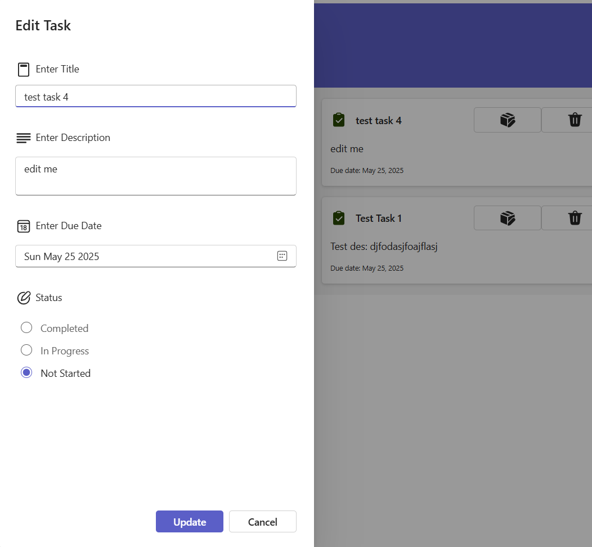

#Task Management System





## Task Manager

A type-safe task management application built with React, TypeScript, and Microsoft Fluent UI.

#### Features

- Create, edit, and delete tasks
- Filter tasks by status (To Do, In Progress, Completed)
- Local storage persistence
- Responsive Fluent UI components
- Comprehensive TypeScript typing

#### Technologies

- React 18
- TypeScript 4+
- Fluent UI 8+

#### Project Structure

```
src/
├── components/      # Type-safe React components
├── types/          # Type definitions
├── utils/          # Utility functions with types
└── App.tsx         # Main application with typed state
```

This project demonstrates how to build a fully type-safe React application using modern TypeScript features with Fluent UI components.
