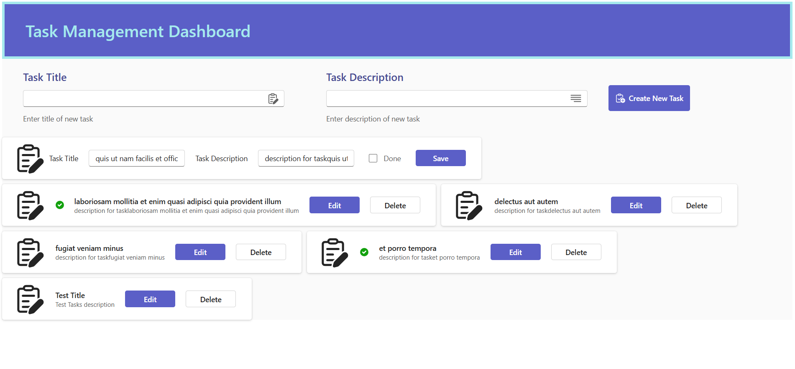

# Task Manager with React + TypeScript + Fluent UI

A comprehensive demo application focusing on mastering React's `useEffect` hook while building a real-world task management interface.



## Key Features

- Complete CRUD operations for tasks
- Advanced `useEffect` patterns implementation
- Race condition prevention techniques
- Fluent UI component integration
- TypeScript type safety throughout
- Real-world async operation handling

## Core Learning Objectives

This project extensively covers:

1. All `useEffect` use cases:
   - Component mounting/unmounting
   - Dependency tracking
   - Cleanup functions
   - Async operations
   - Performance optimization

2. Advanced patterns:
   - Race condition prevention
   - Conditional effect execution
   - Multiple effect separation
   - Complex dependencies

## Installation

1. Clone the repository:
```bash
git clone https://github.com/yourusername/task-manager.git
cd task-manager